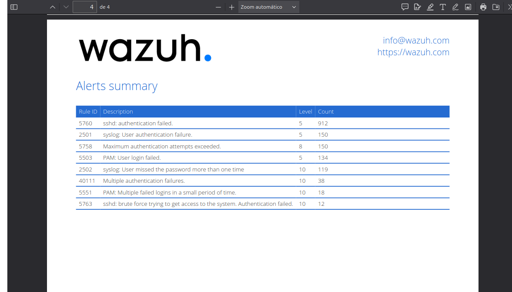

# 🛡️ Lab de Detecção de Ameaças: Blue Team (Wazuh) vs Red Team (Kali)

### 📝 Resumo do Projeto
Simulação prática de um ciberataque em ambiente controlado para validar a capacidade de detecção e resposta de um SOC.
O objetivo foi realizar um ataque de **Força Bruta (Brute Force)** contra um servidor Linux e identificar os indicadores de compromisso (IoCs) em tempo real utilizando o SIEM **Wazuh**.

### 🏗️ Arquitetura do Laboratório
* **Atacante (Red Team):** Kali Linux rodando em VM (Modo Bridge). Ferramenta: `Hydra`.
* **Vítima/Defensor (Blue Team):** Servidor Ubuntu Físico monitorado por Agente Wazuh (Endpoint).
* **SIEM:** Wazuh Server (Manager, Indexer e Dashboard).

### ⚔️ Execução do Ataque
Foi executado um ataque de dicionário via SSH utilizando a wordlist `rockyou.txt`:
```bash
hydra -l root -P rockyou.txt ssh://192.168.1.103 -t 4
```

### 🚨 Análise e Detecção (Resultados)
O SIEM detectou o ataque instantaneamente. Como evidenciado no relatório anexo:
* **912** eventos de falha de autenticação (`Rule 5760`).
* **12** alertas críticos de **Brute Force** confirmados (`Rule 5763`).
* Classificação automática do incidente baseada no framework **MITRE ATT&CK**.



### 🛠️ Tecnologias
* Wazuh SIEM & XDR
* Kali Linux (Hydra)
* SSH Hardening
* Linux Administration
